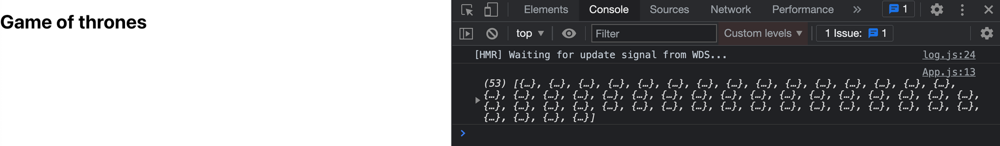
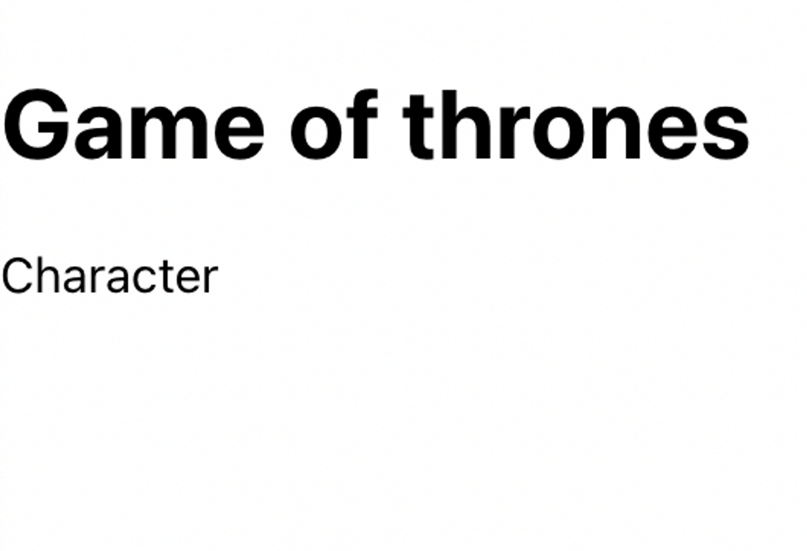
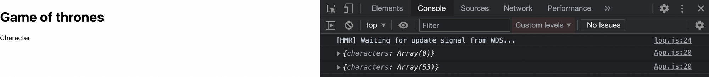
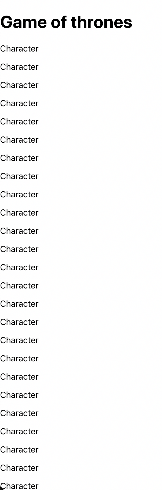
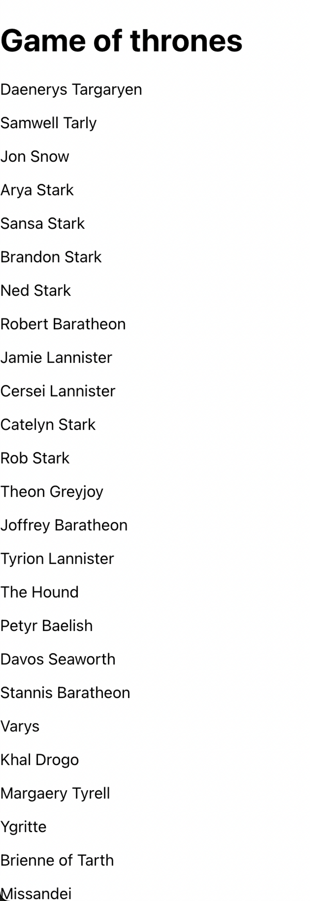
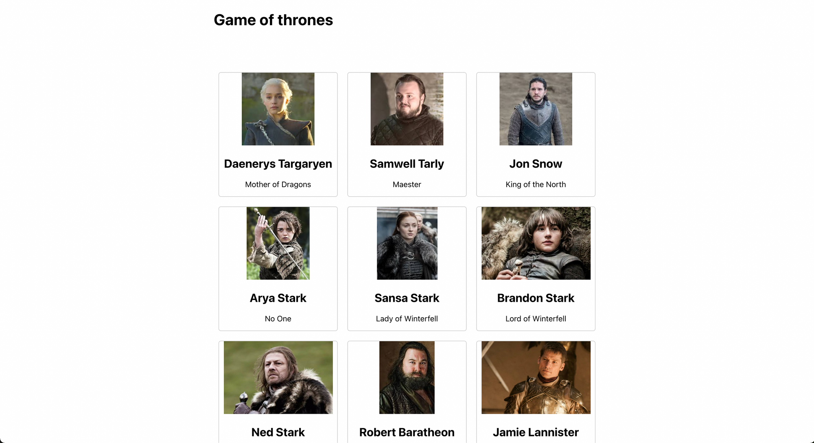

# Game of thrones

Créer un repo sur github.com `game-of-thrones`

Créer l'app react dans `konexio/react/`

```jsx
npx create-react-app game-of-thrones
```

Utilisez votre propre css pour le style

## 01 - App.js

Vider le `App.js` et remplacer le contenu par

```jsx
import React from "react";

class App extends React.Component {
	render() {
		return <h1>Game of thrones</h1>;
	}
}

export default App;
```

-   Dans `App.js`, écrire la méthode `constructor`, et dedans, définir le `state` initial:

```jsx
this.state = {
	characters: [],
};
```

Nous allons utiliser l'api [`https://thronesapi.com`](https://thronesapi.com/) pour fetcher les informations sur les personnages (characters en anglais) de game of thrones.

-   Dans `App.js`, écrire la méthode `componentDidMount`, et dedans, faire un fetch sur l'endpoint suivant:

    [ameofthrones](https://thronesapi.com/api/v2/Characters)

    ```jsx
    fetch("https://thronesapi.com/api/v2/Characters")
    	.then((result) => result.json())
    	.then((result) => console.log(result));
    ```

    Le console log devrait sortir ça:

    

-   Si vous avez un résultat similaire, vous pouvez maintenant mettre à jour votre state `characters` avec la réponse de l'api (dans le deuxième then)

```jsx
this.setState({ characters: result });
```

## 02 - Character.js

Nous allons créer un component pour afficher les informations de chaque personnage:

-   Créer le dossier `component` dans `src`
-   Créer le fichier `Character.js` dans `src/components`

Copier/coller le code suivant dans le components `Character.js`

```jsx
import React from "react";

class Character extends React.Component {
	render() {
		return <p>Character</p>;
	}
}

export default Character;
```

-   Importer le component `Character` dans `App.js`
-   Afficher le component `Character` dans le render de `App.js` pour être sur qu'il marche

Vous devriez avoir ce résultat:

    

## 03 - Map

-   Dans `App.js`, dans le render, faire un console log de `this.state`. Si vous n'avez pas le résultat suivant, appelez le formateur
    

-   Dans `App.js`, dans le render, faire un `map` sur `this.state.characters`, et dans le map afficher le component `Character`. Vous devriez avoir un résultat similaire:
    

-   Passez une props `name` dans le components `Character`, qui prendra la valeur du nom complet du personnage.
-   Dans le component `Character`, afficher la props name avec `{this.props.fullName}`
-   Vous devriez avoir un résultat similaire:

    

-   Passez maintenant les props suivante dans `Character`
    -   `title`, qui prendra la valeur du title du character
    -   `image`, qui prendra la valeur de imageUrl du character
-   Dans `Character`, afficher la props `image` et la props `title`


## 05 - Styles

-   Styliser le component pour faire une grille. Vous pouvez utiliser bootstrap ou votre propre css



## Bonus 1

Créer une liste de personnages favoris. Pour cela quelques indices:

-   Ajouter une nouvelle clé au state dans `App.js`, que l'on nommera `favorites` et qui sera un tableau vide
-   Ajouter une nouvelle méthode dans `App.js`, que l'on nommera `handleFavoriteClick`. Cette méthode prendra en paramètre un objet character, que l'on mettra dans le tableau des favorites
-   Passer cette méthode en props dans `Character`
-   Ajouter un button qui appellera la fonction que l'on vient de passer en props
-   Afficher la liste des favoris

## Bonus 2

-   En utilisant la doc de l'api, trouver un moyen d'afficher une grille des continents de westeros
    [https://thronesapi.com/swagger/index.html?urls.primaryName=Game of Thrones API v2](https://thronesapi.com/swagger/index.html?urls.primaryName=Game%20of%20Thrones%20API%20v2)
-   Créer un systeme d'onglets, qui aura un onglet `Personnages` et un onglet `Continents`
-   Quand on clique sur l'onglet `Personnages`, on affiche la liste des personnages
-   Quand on clique sur l'onglet `Continents`, on affiche la liste des continents

## Bonus 3

-   Utiliser styled-components pour faire le style
    [https://styled-components.com/](https://styled-components.com/)

## Bonus 4

-   Dans la liste des personnages, faire un style particulier pour les `<Character />` qui sont en favoris

## Bonus 5

-   En utilisant la doc, modifier un character.
-   Si la réponse est de status 200, afficher un message de succès

## Bonus 6

-   Utiliser [https://masonry.desandro.com/](https://masonry.desandro.com/) pour la grille, en faisant des grid items de hauteur différente
# game-of-thrones
